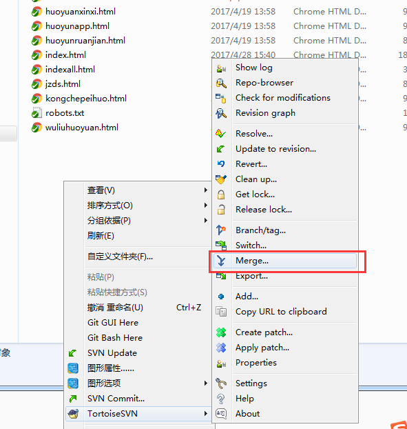
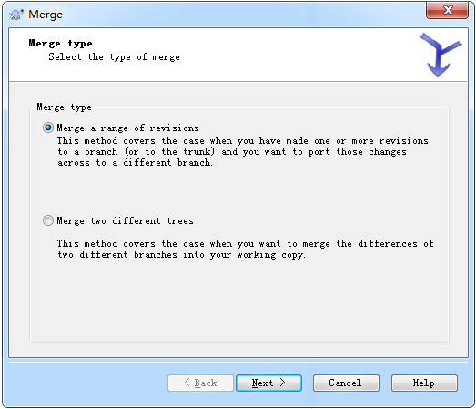
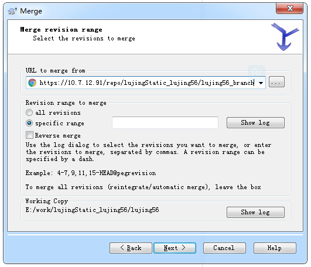
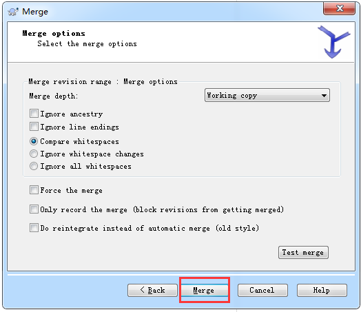
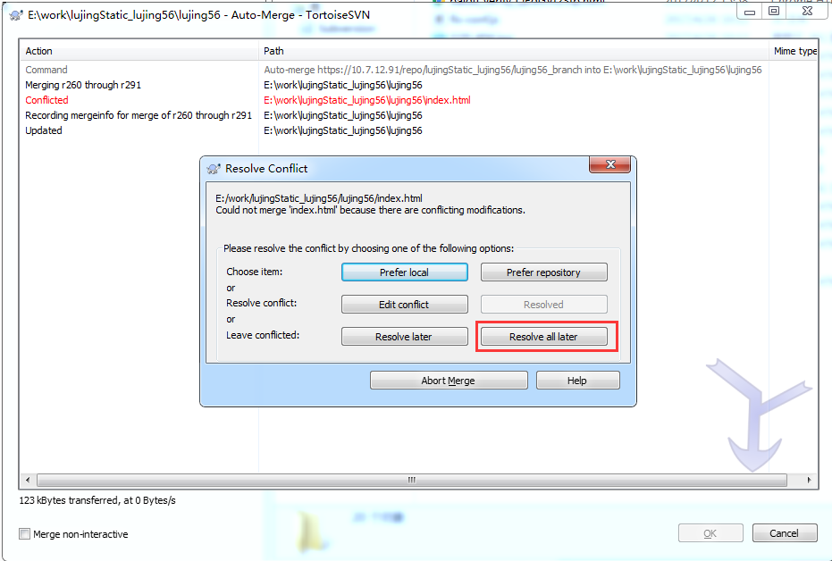

#svn分支管理策略#

============================================

每次发布完成 必须打tag分支 命名：例如，lujing56_tag_20170505

有迭代需求则在主干上拉取分支进行开发命名 lujing56_branch,分支开发测试完成再删除

主干则用于发布生产环境 及生产环境的紧急bug修复

svn路径示例

    svn--|
         |--lujing56
         |--lujing56_branch
         |--lujing56_tag_20170505

-------------------------
  
**合并方式**

===========================

在主干目录右击svn选项-选中merge  

 

选择第一项  

输入要合并的分支名

点击下一步

如果冲突会弹出提示 选择 延迟解决。再根据提示保留最终代码 再次提交就可以 

如果正常 则不需要改动可直接提交

